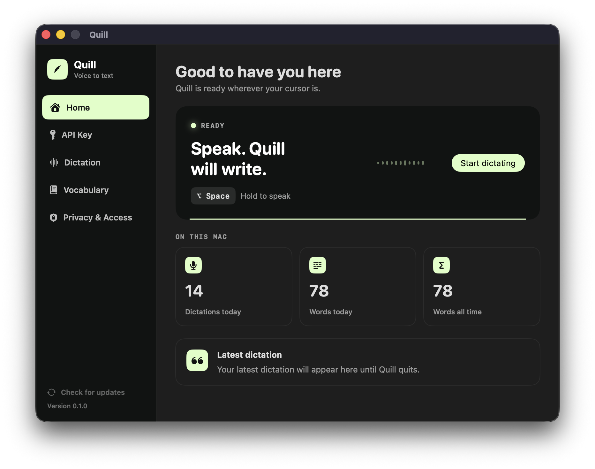

  

<h1 align="center">Quill</h1>

  <strong>Fast, system-wide voice typing for macOS.</strong> 
  Speak naturally, then let Quill place polished text wherever you are writing.

  macOS 14+ &nbsp;·&nbsp; Open source &nbsp;·&nbsp; Bring your own Gemini API key

---

Place your cursor in an editable field, hold <kbd>⌥ Option</kbd> + <kbd>Space</kbd>, speak, and release. Your transcript appears at the original cursor so you can keep working without changing context.

  

## Features

- **Dictate across macOS:** Write in browsers, editors, messaging apps, and other standard text fields.
- **Use the workflow you prefer:** Choose hold-to-speak or press-to-start/stop dictation.
- **Get cleaner text automatically:** Smart mode improves punctuation and readability; Verbatim mode stays closer to your exact words.
- **Speak in your language:** Let Quill detect the language or select a preferred language.
- **Teach Quill your terminology:** Add names, technical terms, acronyms, and product vocabulary.
- **See what is happening:** A lightweight floating indicator responds while Quill listens and processes speech.
- **Track simple local usage:** View daily and lifetime dictation and word counts without saving transcript history.

## Getting started

### What you need

- A Mac running macOS 14 or later
- A Gemini API key with access to the Live transcription model

### Get a Gemini API key

1. Open the [Google AI Studio API keys page](https://aistudio.google.com/app/apikey) and sign in with your Google account.
2. Select **Create API key**, then choose or create a Google Cloud project when prompted.
3. Copy the generated key. Quill will ask for it during onboarding.

### Set up Quill

1. Move `Quill.app` to your **Applications** folder and open it.
2. Follow onboarding to allow **Microphone** and **Accessibility** access.
3. Paste your Gemini API key and finish setup.
4. Click inside any editable text field.
5. Hold <kbd>⌥ Option</kbd> + <kbd>Space</kbd>, speak, then release.

Quill remains available from the menu bar. Open its settings to change the shortcut, dictation behavior, transcription style, language, vocabulary, launch-at-login preference, or API key.

## Everyday controls

| Action | Default behavior |
| --- | --- |
| Start dictating | Hold <kbd>⌥ Option</kbd> + <kbd>Space</kbd> |
| Finish and insert | Release the shortcut |
| Cancel dictation | Press <kbd>Esc</kbd> |
| Open Quill | Select the Quill icon in the menu bar |
| Change the API key | Open **Settings → Privacy & Access** |
| Check for updates | Choose **Quill → Check for Updates…** or use the button in the app sidebar |

The shortcut can also be changed to <kbd>⌃ Control</kbd> + <kbd>Space</kbd> or <kbd>⇧ Shift</kbd> + <kbd>⌘ Command</kbd> + <kbd>Space</kbd>.

## Privacy and local data

Quill is bring-your-own-key software. It does not run an intermediary transcription service.

| Data | How Quill handles it |
| --- | --- |
| Microphone audio | Held in memory while dictating and streamed directly to Google's Gemini API. Quill never writes recordings to disk. |
| Transcripts | Inserted at the active cursor. Transcript history is not stored; the most recent transcript remains in memory only until Quill quits. |
| Usage statistics | Only dictation and word counts are stored locally on the Mac. They can be reset from **Privacy & Access**. |
| Gemini API key | Stored at `~/Library/Application Support/Quill/api-key` with owner-only (`0600`) permissions. It is not stored in Keychain and remains until replaced. |
| Update checks | Sparkle periodically reads Quill's public release feed from GitHub. System profiling is disabled, and no API key, transcript, or usage statistics are included. |

Accessibility permission is used only to return focus to the original text field and insert the completed transcript. Microphone permission is used only while dictation is active.

## Development

See [Building Quill from Source](docs/BUILDING.md) for local development, testing, release signing, and GitHub publishing instructions.

## License

Quill is available under the [Apache License 2.0](LICENSE).
